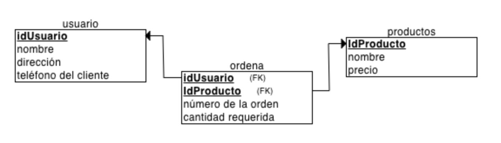
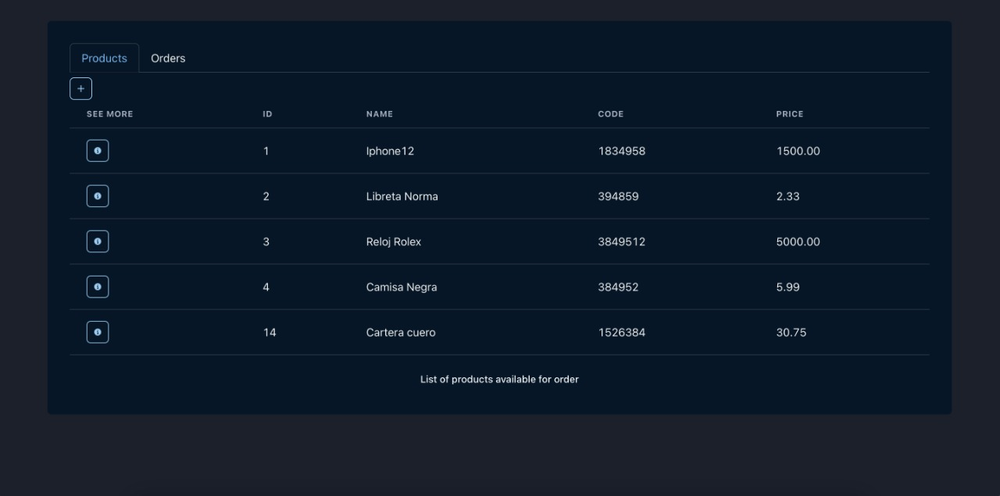

## Installations

Clonar el repositorio:

```
git clone https://github.com/Juan7diaz/Web-API-Prueba.git
```

Launch backend server (terminal 1)

- `cd backend`
- `pip install virtualenv`
- `python -m virtualenv venv`
- `. venv/bin/activate` (On Unix or MacOS)
- `. venv\Scripts\activate` (On Windows)
- `pip install -r requirements.txt`
- `python manage.py runserver`

Launch front-end server (terminal 2)

- `cd frontend`
- `yarn`
- `yarn dev`

Now you can visit

> [http://127.0.0.1:8000/api](http://127.0.0.1:8000/api)

> [http://localhost:5173/products](http://localhost:5173/products)

## Images



